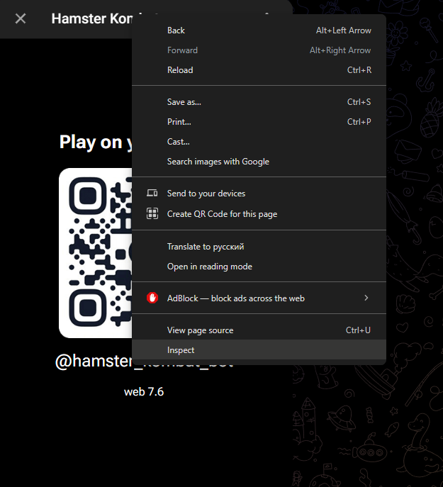
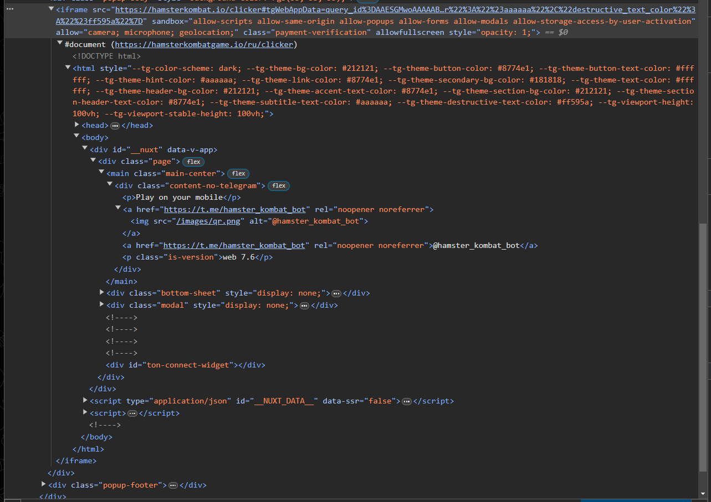
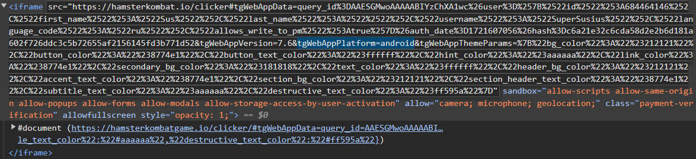
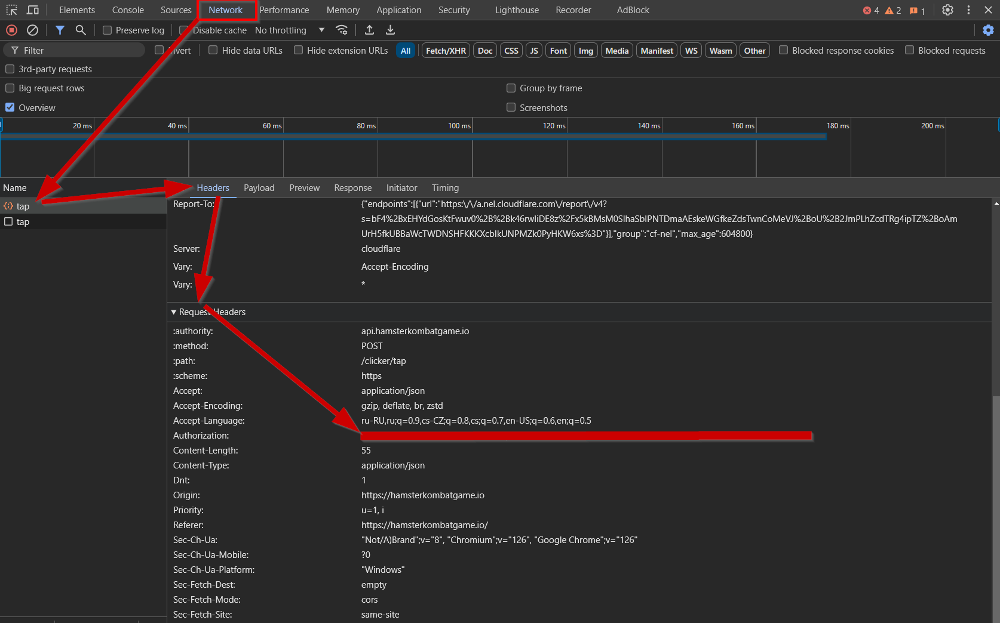
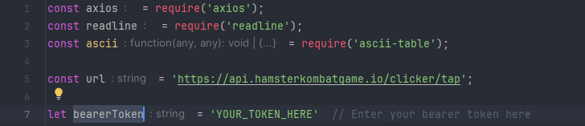

# Installation

## Install [Node.js](https://nodejs.org/en/download/) if you don't have it installed.

## Grab your Bearer Token

### 1. Go to [Hamster Kombat Telegram Bot](https://web.telegram.org/k/#@hamster_kombat_bot) and launch the game.
### 2. After launching on web you will see QR code to scan with your phone, instead of right click on it and inspect element.

### 3. Find the `iframe` tag and double-click on the `src` attribute.

### 4. Replace tgWebAppPlatform value with `android` and press enter.

### 5. The game will launch in the web version, now open the console by pressing `F12` and go to the `Network` tab.
### 6. Make a tap, and you will see a request `tap` in the network tab, click on it and go to the `Headers` tab.
### 7. Find the `Authorization` header and copy the value of the `Bearer` token.

### 8. Now go to `bot.js` and paste the token in the `bearerToken` variable.

### 9. Open the console and enter `npm install` command to install the required packages and then `node bot.js` to start the bot.

# Usage

### This bot waits for the full energy to be restored and then sends taps for full energy in one request.
### This way you get maximum possible amount of coins per day. (Which generally is 86400 (one day in seconds) * 3 (energy restored per second) = 259200 coins per day)
### The bot also automatically use boosts (if available) to refill energy and sends taps for full energy immediately after that.

# Commands

## You can use a few commands to interact with the bot:

* ### `claim {CODE}` - claims a daily code (If you know the code you can just type `claim {CODE}` and the bot will claim it for you without the need to go to the game and click it)
* ### `token {TOKEN}` - sets the bearer token (If you want to change the token you can just type `token {TOKEN}` and the bot will change it for you without the need to restart the bot)

# Note

```diff
- The Bearer Token is sensitive information, do not share it with anyone. 
- Also the Bearer Token might expire, so you will need to get a new one, you can do it by following the steps above or if request is failed due to invalid token the bot will ask you to type the new one to continue the process.
- The bot will not work if you stop the process, if you want you can host it on a server by yourself to keep it running 24/7.

- This bot is for educational purposes only. I am not responsible for any misuse of this bot.
```


